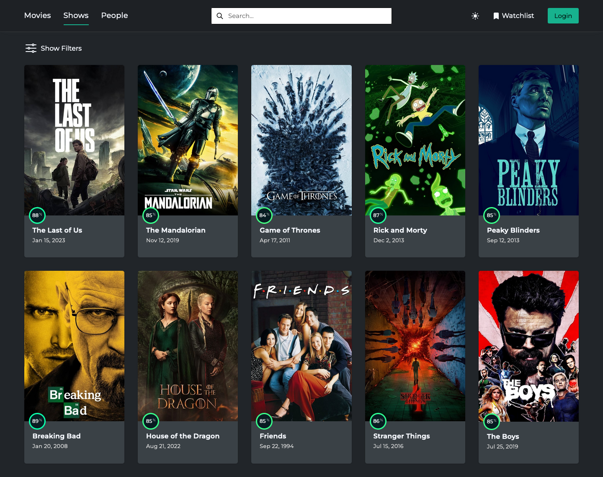

# Movie Gallery

Demo: https://movies-and-shows.netlify.app/

## Overview

This is a personal project of mine aimed to create an interactive site where users can find popular films & shows, watch trailers, read synopses, and much more. The data is received from the [TMDB API](https://developers.themoviedb.org/3/getting-started/introduction).

## My Process

After building various small scale projects, I wanted to challenge my skillset and build something on a scale that I had never done before. I had the idea of building a site where users can search & filter for movies, and then checkout the trailer, summary, rating, images, cast & other details to help them decide on what they want to watch.

I decided to take action on this idea and build it as a React app. I began by getting the most popular current movies from the API and rendering them out in a grid layout as card like components. Additionally, I added a search bar for users to find any movie they want. The API already supported a page query so I integrated pagination for users to fetch more movies. This made up the barebones of the home page, the next step was to link each card component to a separate route to view more information about the movie.

For the details page, I took inspiration from [themoviedb](https://www.themoviedb.org/tv/1396-breaking-bad) and wanted to create a similar type of design. Most importantly, I wanted to have a user-friendly image gallery and embedded trailer because I deemed these as being the most interactive and visually attractive features. After some digging, I found the library [react-image-gallery](https://github.com/xiaolin/react-image-gallery) and chose to use it for its ease of use, mobile swipe gestures, and slide animations.

For the last major route, I wanted to link the cast members to a separate page to view details for each individual actor/actress. Building this page was pretty straightforward, I utilized a dual-column layout, one for a photo with some personal details, and the other for a biography and their known work.

### Built with

- Semantic HTML5 markup
- React.js
- SCSS modules
- [Immer](https://github.com/immerjs/immer)

## Author

- Website - [Mehdi Sajedi](https://mehdi-sajedi.github.io/)
